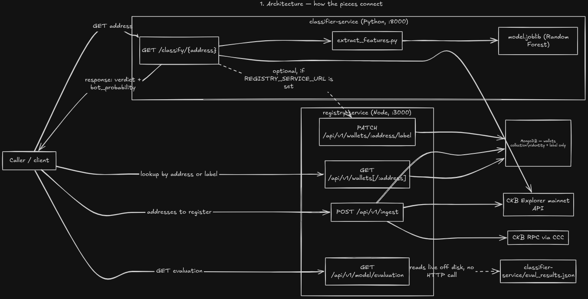

# CKB Wallet Behaviour Intelligence

**Real-mainnet-data behavioral classification for CKB wallet addresses - bot, human, or uncertain - served as two independently deployable services under a stable, versioned API.**

<div align="center">

[](https://github.com/FadhilMulinya/ckb-intel)
[](https://nodejs.org)
[](https://www.typescriptlang.org)
[](https://www.python.org)
[](https://pip.pypa.io)
[](https://www.docker.com)
[](https://github.com/ckb-devrel/ccc)
[](https://github.com/nervosnetwork/ckb-explorer)
[](LICENSE)
[](https://talk.nervos.org/t/spark-program-ckb-wallet-behaviour-intelligence/10338)

</div>

> [!CAUTION]
> Work in progress, built in public as part of the [Nervos Spark Program](https://talk.nervos.org/t/spark-program-ckb-wallet-behaviour-intelligence/10338). APIs may change between weekly milestones - don't rely on it in production yet.

Give this project a CKB mainnet address and it hands back a behavioral verdict - `bot`, `human`, or `uncertain` (the model isn't confident either way), or `unknown` (not enough transaction history to say anything) - derived entirely from that address's real on-chain activity, never synthetic data. Built for the [Nervos Spark Program](https://talk.nervos.org/t/spark-program-ckb-wallet-behaviour-intelligence/10338) as reusable infrastructure the wider CKB ecosystem (wallets, explorers, analytics tools) can build on rather than each reimplementing wallet-behavior analysis from scratch - see §5 below for every endpoint that exposes this.

> **Data provenance:** every artifact in this pipeline - dataset, features, trained model - is derived exclusively from real CKB mainnet transactions. No synthetic/simulated data is used anywhere. See §7 below for how that's enforced in code.

---

## 1. What the project actually does

1. A real CKB mainnet address goes in.
2. Its transaction history is fetched and turned into behavioral features - timing regularity, amount patterns, counterparty fan-out, and similar shape statistics (never raw magnitudes, so the model learns behavior, not one wallet's specific numbers).
3. A trained classifier scores it: `bot`, `human`, `uncertain` (the model isn't confident either way), or `unknown` (not enough history to say anything).
4. That result can be looked up later by address, or listed in bulk by label, through a small wallet registry.

The project is split into two independent services, each in its own language, each with a single clear responsibility:

| | [`classifier-service/`](./classifier-service/) | [`registry-service/`](./registry-service/) |
|---|---|---|
| Language | Python | TypeScript / Node |
| Responsibility | Fetch transaction history, extract behavioral features, train and serve the classifier | Resolve wallet identity, store the classification label the model produces, serve it back out |
| Stores | Nothing persistent (just the trained model file) | MongoDB - wallet identity + label only, **never transaction data** |
| Port | 8000 | 3000 |
| Docs | `http://localhost:8000/api/v1/docs` | `http://localhost:3000/api/v1/docs` |

They're connected by exactly one thing: after Python scores a wallet, it can optionally tell Node the result over HTTP. Node never runs the model, never touches transaction data, and never decides what label a wallet gets - it only stores whatever it's told. See §6 for the specifics.

## 2. Summary: the Python side (`classifier-service/`)

Does the actual classification work, end to end:

- Pulls real mainnet transaction history for an address from the CKB Explorer API.
- Extracts 10 behavioral features (ratios/shape statistics - interval regularity, capacity variation, counterparty fan-out entropy, etc.).
- Trains a supervised binary classifier (Random Forest, selected by cross-validation over 4 candidate models) on ~264(constantly growing) real, heuristically-labeled mainnet addresses.
- Serves classification over a CLI (`predict.py`) and a REST API (`app.py`, FastAPI).
- Ships its own evaluation report (accuracy/precision/recall/F1/confusion matrix/feature importance) after every training run.

Full detail - methodology, features, results, known limitations - lives in [`classifier-service/README.md`](./classifier-service/README.md).

## 3. Summary: the Node side (`registry-service/`)

Does none of the modeling - it's a wallet registry:

- Resolves a wallet address to its on-chain identity (lock script hash, network) via CCC.
- Stores exactly one thing per address: the classification label + confidence Python wrote back, plus identity metadata. No transaction data, ever.
- Serves that back out over a REST API, filterable by label (`GET /wallets?label=bot`).
- Re-publishes the Python side's evaluation metrics as JSON, read live off disk, so there's one place to check "how good is the current model."
- Fully documented via a Scalar-powered `/api/v1/docs` page generated from a maintained OpenAPI spec.

Full detail - architecture, data model, every endpoint - lives in [`registry-service/README.md`](./registry-service/README.md).

---

## 4. Quickstart - run both services with one command

```bash
./scripts/dev.sh
```

Starts MongoDB (if not already running), `registry-service` on `:3000`, and `classifier-service`'s FastAPI service on `:8000` - wired together automatically. First run creates a Python venv and installs dependencies for you. Ctrl-C stops everything it started. Once both are healthy it prints:

```
╔══════════════════════════════════════════════════════════════════╗
║   CKB Wallet Behaviour Intelligence -- dev stack running          ║
╠══════════════════════════════════════════════════════════════════╣
║   registry-service     docs   http://localhost:3000/api/v1/docs   ║
║   classifier-service   docs   http://localhost:8000/api/v1/docs   ║
╚══════════════════════════════════════════════════════════════════╝
```

Each `/api/v1/docs` page is the full endpoint reference for that service - see it there rather than in this file.

### Running the pieces individually

See [`classifier-service/README.md`](./classifier-service/README.md) (training pipeline + CLI + API) and [`registry-service/README.md`](./registry-service/README.md) (Node service) for standalone setup.

### Deployment

A `Dockerfile` is provided in `classifier-service/` for container-based deployment (VPS + reverse proxy + domain, per the original grant's infrastructure budget). Public deployment is scheduled to happen this week.

### Testing

Each service has its own offline unit tests (mocked network, no services required - see each README's Testing section). For real, end-to-end coverage across both services together - every endpoint, the label write-back, error paths - run:

```bash
./scripts/e2e.sh
```

This starts an isolated MongoDB + both services (refusing to run if ports 3000/8000/27017 are already in use, so it never silently tests against an existing `dev.sh` session), runs [`tests/e2e_test.py`](./tests/e2e_test.py) against them, tears everything down, and exits non-zero on any failure - safe to wire into CI as a single command.

---

## 5. API endpoints

Every route on both services lives under `/api/v1`. **The intent is that these stay stable - once a route ships under `/api/v1`, its request/response shape shouldn't change.** A breaking change should get a new `/api/v2` prefix alongside it rather than modifying `/v1` in place, so anything built against `/api/v1` today keeps working (see each service's README §Architecture for where that convention is documented in code). This is a versioning discipline the team commits to, not something enforced automatically - treat each service's `/api/v1/docs` page (Scalar, backed by a maintained OpenAPI spec at `/api/v1/openapi.json`) as the source of truth for the exact current contract if this table and the code ever drift.

**`classifier-service` - `http://localhost:8000`** (does the actual classification; not versioned under `/api/v1` for its two functional routes, only its docs are):

| Method | Route | What it does |
|---|---|---|
| GET | `/classify/{address}?max_tx=` | Fetches the address's real mainnet history, extracts features, scores it. Returns `verdict` (`bot`/`human`/`uncertain`/`unknown`) + `bot_probability`. This is the one call that does everything - no prior setup on the other service required. |
| GET | `/health` | Liveness + whether the trained model loaded at startup (503 if not). |
| GET | `/` | Landing pointer to the docs. |
| GET | `/api/v1/docs` | Interactive Scalar reference for this service. |
| GET | `/api/v1/openapi.json` | The OpenAPI spec backing the docs page. |

**`registry-service` - `http://localhost:3000/api/v1`** (wallet identity + classification storage; no modeling):

| Method | Route | What it does |
|---|---|---|
| GET | `/health` | Liveness check. |
| GET | `/chain/status` | Current mainnet tip block, proving CKB RPC connectivity; cached 5s. |
| POST | `/ingest` | Body `{ "addresses": ["ckb1..."] }` - resolves wallet identity (lock script hash, tx-count/first/last-seen). Never stores transaction data. |
| GET | `/wallets?page=&pageSize=&label=` | Lists wallets, optionally filtered by classification label. |
| GET | `/wallets/{address}` | One wallet's identity + classification record. 404 if never seen. |
| PATCH | `/wallets/{address}/label` | Body `{ "label": "bot"\|"human"\|"uncertain"\|"unknown", "botProbability"?: number }` - writes back a classification. Upserts, so it works even on an address never ingested. |
| GET | `/model/evaluation` | The classifier's latest accuracy/precision/recall/F1/confusion matrix/dataset stats/label distribution, read live off `classifier-service/eval_results.json`. |
| GET | `/docs` | Interactive Scalar reference for this service. |
| GET | `/openapi.json` | The OpenAPI spec backing the docs page. |

Full per-field descriptions, request/response examples, and every status code each route can return live in each service's own README and its `/api/v1/docs` page - this table is a map, not the full contract.

---

## 6. How the two services connect

Set `REGISTRY_SERVICE_URL` (e.g. `http://localhost:3000`) when running `classifier-service`, and after scoring a wallet it writes the verdict back to `registry-service` via `PATCH /api/v1/wallets/:address/label`. Unset (the default), nothing changes - Python's classification works exactly the same either way; the write-back is a pure side effect, wrapped so a failure there never breaks a classification response.

The label values Python sends (`bot`/`human`/`uncertain`/`unknown`) are exactly what Node's schema accepts - Node's schema was defined to match Python's output, not the other way around, so there's no translation layer to keep in sync between the two.

### Why two services instead of one combined endpoint

There is deliberately no single "ingest and classify" endpoint that does both in one call. This is a design choice, not a gap:

- **The dependency stays one-directional and soft.** Node has zero runtime dependency on Python - it never calls it, and works completely on its own. Python's dependency on Node is optional and best-effort: if the write-back fails or `REGISTRY_SERVICE_URL` is never set, classification still returns correctly. A combined endpoint would force whichever service hosts it into a *hard* dependency on the other being reachable, for that one call - the first place in the system where one side's uptime would gate the other's.
- **It would double the work per request, not remove it.** `POST /ingest` already pages through an address's transaction history once (to compute `txCount`/`firstSeenMs`/`lastSeenMs`). `GET /classify` pages through the same history *again*, separately, for feature extraction. Chaining them into one call doesn't eliminate that duplication - it just stacks both full history fetches plus model inference into a single synchronous request, which is slower, not faster, than calling either endpoint on its own.
- **Failure modes stay explicit.** Today, an ingestion failure and a classification failure are two clean, independently-handled errors, each already reported precisely (ingestion failures are logged and simply omitted from `results`; classification failures return a specific 400/502/500 depending on cause). A combined call would have to invent a new "partially succeeded" contract - did ingest work but classify fail, or the reverse? - that neither side currently needs to answer.
- **Each service can be developed, tested, and deployed independently.** Every test in this repo (Node's smoke tests, Python's offline test suite, and the full live loop) passes with the other service never running. That's only true because nothing here requires them to talk synchronously in one request.

The two-call pattern (`GET /classify/{address}` on Python, then `GET /wallets/{address}` on Node to read the stored result) costs one extra HTTP round trip from a caller's perspective, in exchange for keeping both services independently correct, independently deployable, and independently debuggable. If a single combined call is ever worth adding, the right shape is a thin orchestration wrapper on top of the two existing endpoints - not new logic duplicated into either service.


## 7. Data provenance (real data only)

This is the core thing the Spark Program committee asked us to guarantee, so it's enforced at multiple points, not just documented:

- `fetch_real_data.py` pulls exclusively from the CKB Explorer **mainnet** API.
- `classifier-service/extract_features_real.py` tags every output row with `data_origin: "real_mainnet"`.
- `classifier-service/train_eval.py` requires real, labeled mainnet data to exist and trains only on it. No synthetic data path exists anywhere in this pipeline.
- `registry-service` stores no transaction data at all - only wallet identity and the label Python writes back - so there's no second, uncontrolled place data could leak in.

Current real dataset: **104 human-like + 160 bot-like = 264 labeled addresses** (proposal target: 500 + 500 = 1,000) , but constantly updating the data.
